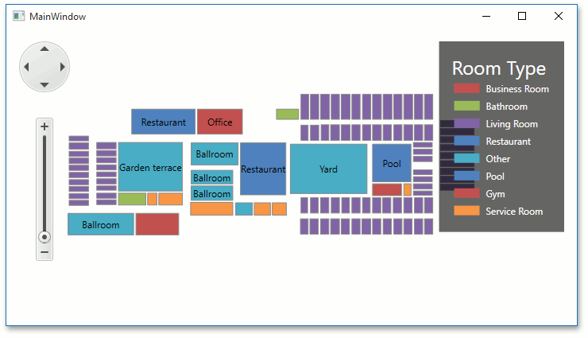

<!-- default badges list -->

<!-- default badges end -->

# Map for WPF - Load a Vector Cartesian Map

The example shows how to create a simple map application that draws vector data using [Cartesian coordinates](https://en.wikipedia.org/wiki/Cartesian_coordinate_system).

## Files to Review

* [MainWindow.xaml](./CS/MapLesson2/MainWindow.xaml) (VB: [MainWindow.xaml](./VB/MapLesson2/MainWindow.xaml))

## Documentation

* [Lesson 2 - Load a Vector Cartesian Map](https://docs.devexpress.com/WPF/113939/controls-and-libraries/map-control/getting-started/lesson-2-load-a-vector-cartesian-map)
* [How to: Load a Vector Cartesian Map](https://docs.devexpress.com/WPF/113976/controls-and-libraries/map-control/examples/vector-data/customize-data-appearance/how-to-load-a-vector-cartesian-map)
* [Map Coordinate Systems](https://docs.devexpress.com/WPF/113959/controls-and-libraries/map-control/coordinate-systems/map-coordinate-systems)
<!-- feedback -->
## Does this example address your development requirements/objectives?

 

(you will be redirected to DevExpress.com to submit your response)
<!-- feedback end -->
